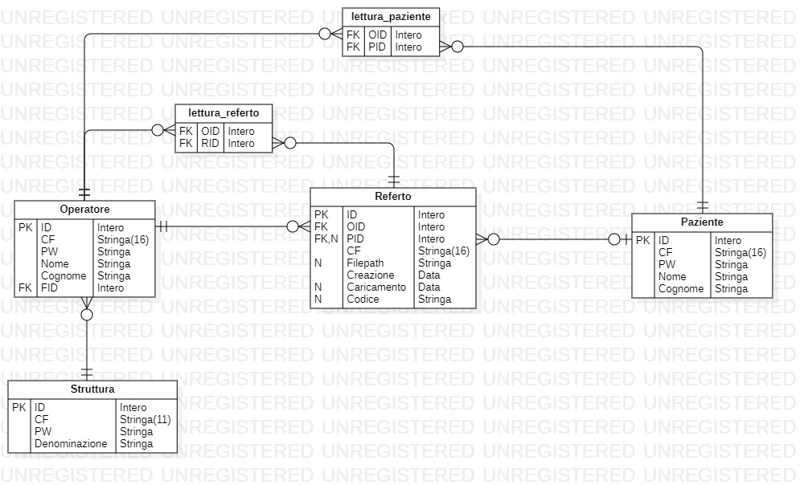

# Diagramma ER

## Legenda 
- PK: Chiave primaria
- FK: Chiave esterna
- N:  Può avere valore nullo
- singola linea sbarrata con pallino: 0..1
- singola linea sbarrata senza pallino: 1
- 3 linee ad albero con pallino: 0..*
- 3 linee ad albero senza pallino: 1..*

## Descrizione
Il progetto usa un database MySQL per registrare i dati degli Utenti, dei Referti e degli accessi.

La tabella Paziente rappresenta i pazienti registrati alla piattaforma.

La tabella Operatore rappresenta gli operatori e i medici, ogni Operatore deve essere collegato ad una Struttura (sanitaria).

La tabella Struttura rappresenta le istituzioni/cliniche/strutture sanitarie dove lavorano gli operatori.

In Referto sono salvate le informazioni del referto come la data di creazione e di caricamento del referto, il riferimento per il referto. Inoltre si collega con l'operatore che l'ha creato e, se presente, con il paziente; se non è presente nella pagina del referto viene mostrato il codice fiscale del paziente inserito dall'operatore e viene mostrato a quest'ultimo il codice per l'accesso che va comunicato al paziente.

La tabella lettura_referto registra gli accessi consentiti ad un singolo referto da parte di un Operatore.

La tabella lettura_paziente registra gli accessi consentiti a tutti i referti di un Paziente a un determinato Operatore.