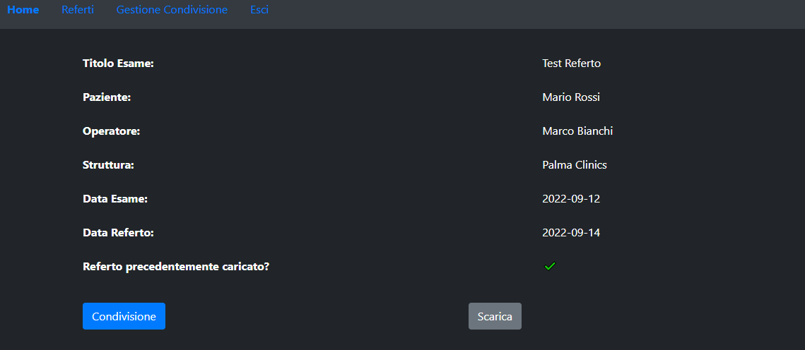
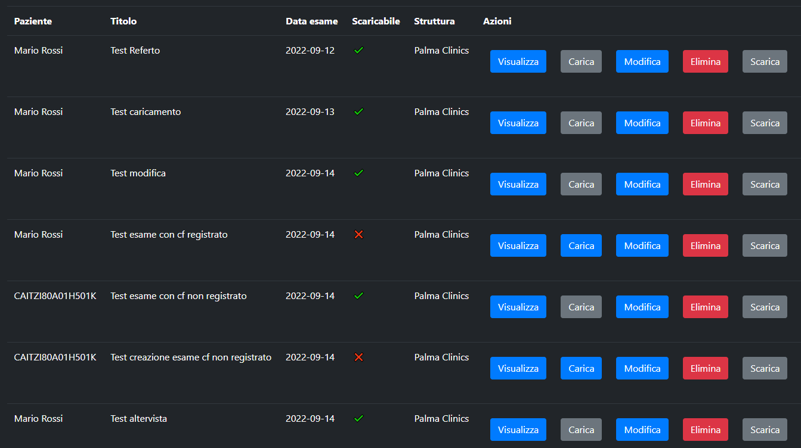

# Manuale Utente

In questo documento sono descritte le principali operazioni che si possono realizzare sulla piattaforma web suddivise per tipologia di utente.

## Paziente

Il Paziente principalmente può accedere ai referti presenti sulla piattaforma e, se registrato, può condividerli direttamente ad un utente operatore presente in piattaforma.

### Visualizzazione di un referto senza essere registrato

Per compire questa operazione è necessario che il paziente abbia ricevuto dall'operatore i codici di accesso al referto.

Una volta ricevuti basta collegarsi al sito e inserirli nell'apposito campo. Premuto il pulsante Visualizza che riporterà l'utente alla pagina di visualizzazione del referto.

Sara quindi possibile visualizzare le informazioni del referto ed eventualmente scaricarlo usando il pulsante 'Scarica'

### Visualizzazione di un referto con utente registrato

Una volta effettuato l'accesso al sito ci si ritroverà nella pagina Home.

Da qui sarà possibile visualizzare la lista dei referti presenti sulla piattaforma spostandosi nella sezione Referti, e per ogni referto sono presenti delle operazioni come la visualizzazione, la condivisione e il download.

Infine aperto un Referto saranno presenti le stesse azioni disponibili nel menù precedente ma saranno mostrate anche altre informazioni.

### Condivisione e revoca condivisione di un Referto

Per la condivisione di un singolo referto con un operatore registrati alla piattaforma è sufficiente premere il pulsante 'Condivisione' nella lista dei referti o nel singolo referto.

Da qui sarà possibile selezionare un operatore e premendo il tasto 'Condividi' si sarà l'accesso al referto.

Dalla stessa pagina sarà possibile revocare la condivisione del referto ad un operatore selezionandolo nel menù e premendo il pulsante 'Rimuovi'.

> Attenzione! Non è possibile revocare la condivisione del referto con l'operatore che l'ha creato.

### Condivisione e revoca condivisione di tutti i Referti

Per effettuare questa operazione è necessario spostarsi nella sezione Gestione Condivisione.

Da qui sarà possibile condividere *tutti* i referti (*passati* e *futuri*) con un operatore. Una volta selezionato l'operatore è sufficiente premere il pulsante 'Condividi'.

Per revocare il consenso serve semplicemente selezionare un operatore e premere il pulsante 'Rimuovi'.

> Attenzione! Questa operazione cancella tutti i referti che sono stati condivisi.

> Unica eccezione: se sono stati condivi dei referti singoli dopo la condivisione di tutti i referti questi rimarranno condivisi.

## Operatore

> Per la visualizzazione di un referto le procedure sono le stesse del Paziente.

### Accesso alla piattaforma

L'accesso alla piattaforma funziona esattamente come quello per il Paziente, l'unico accorgimento è l'impostazione del selettore di ruolo che va impostato ad 'Operatore'.

### Creazione di un nuovo referto

Per creare un nuovo referto bisogna posiziona il puntatore sulla sezione Referti e scegliere 'Crea nuovo referto'.

> Attenzione! La creazione del referto va fatta al momento d'esecuzione dell'esame. Infatti qualora l'utente non sia registrato alla piattaforma il sistema genererà i codici d'accesso che in futuro l'utente potrà usare per consultare il referto.

Da qui l'operatore dovrà inserire il codice fiscale del paziente e il titolo dell'esame. Infine premere 'Conferma'.

### Caricamento di un referto sulla piattaforma

L'operatore per poter caricare i file del referto dovrà accedere alla sezione 'Gestioni Referti' sotto la voce 'Referti'. Da qui potrà o usare il pulsante carica corrispondete al referto che si vuole caricare.

In alternativa si può accedere ad un referto per visualizzare il dettaglio e da lì caricare il file.

Nella pagina di caricamento verrà chiesto di selezionare il file che si vorrà caricare sulla piattaforma e si dovrà confermare il caricamento con 'Conferma'. In alternativa si può resettare il campo 'Scegli file' premendo il pulsante 'Pulisci'.

> Ricorda: può sempre modificare il file caricato sulla piattaforma visualizzando il referto o modificandolo.

### Modifica di un referto

Per modificare un referto è sufficiente premere il pulsante 'Modifica' nella lista dei referti o nella visualizzazione singola del referto.

Si può solo modificare solo il campo del titolo del referto.

### Elimina referto

Per eliminare un referto è sufficiente premere il pulsante 'Elimina' nella lista dei referti o nella visualizzazione singola del referto. 

Una volta presente nella pagina di eliminazione è necessario confermare l'operazione premendo nuovamente il pulsante 'Elimina'. Nella stessa pagina è possibile visualizzare le altre informazioni sul referto.

## Struttura

> Per la visualizzazione di un referto le procedure sono le stesse del Paziente. Si potrà solo visualizzare e scaricare il referto.

### Registrazione ed accesso alla piattaforma

La registrazione e l'accesso avvengono esattamente come quelli dell'utente, la differenza è necessario impostare il selettore del ruolo su 'Struttura'.

### Gestioni Operatori

Nella sezione 'Operatori' sarà possibile gestire tutti gli operatori creati. Infatti sarà possibile aggiungere nuovi Operatori inserendo il loro Nome, Cognome, Codice Fiscale e una password (che andrà poi comunicata all'operatore stesso).

> Attenzione! Gli operatori non si possono registrare in autonomia alla piattaforma, è necessario che ogni singolo operatore sia inserito dall'amministratore dell'account della Struttura Sanitaria.

Inoltre è possibile modificare i dati degli operatori già inseriti variando il campo che si vuole modificare e premendo il pulsante 'Modifica'. Invece premendo il pulsante 'Pulisci' si ripristina il campo al valore salvato dalla piattaforma.
